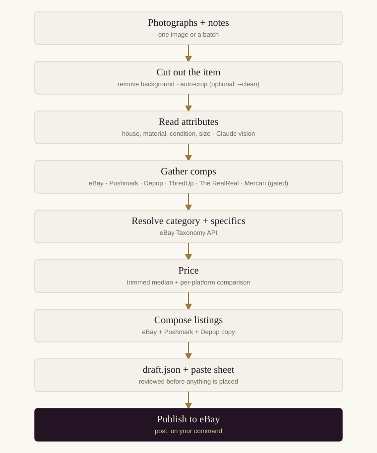
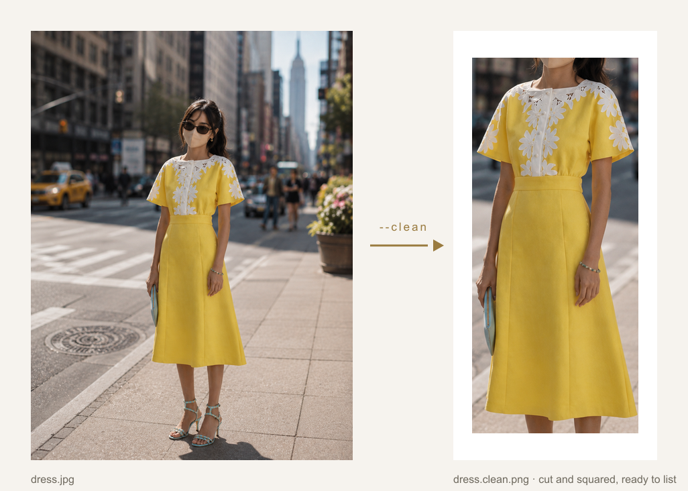
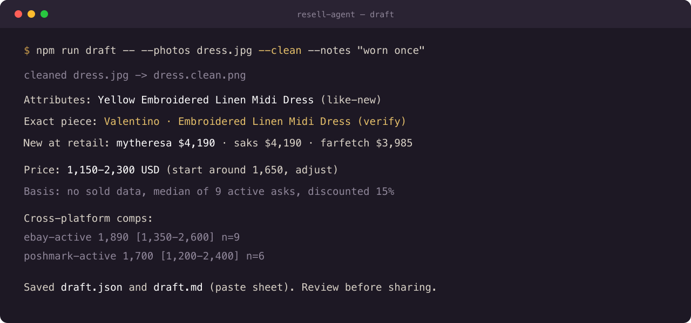

# resell-agent

A resale agent for the pieces worth selling well. Point it at photographs of a
garment or accessory, it identifies the piece, prices it against the market,
writes considered listings for eBay, Poshmark, and Depop, and can place the eBay
listing for you.

Two halves:

- **Brain** (read-only, safe): photos → attributes → comps → price → listing copy.
  Comps are gathered in parallel across sources (eBay by default; Poshmark, ThredUp,
  The RealReal, Mercari optional), and the draft shows a per-platform price
  comparison. Only eBay is a sanctioned API, the rest are opt-in, ToS-risky
  scrapers, off unless you set their `ENABLE_*` flag. The suggested price stays
  eBay-anchored, since that's where `post` lists.
- **Hands** (eBay API + browser-flow adapters): publishes a real listing via the eBay
  Sell API and can route configured browser-assisted platforms through the GUI.

Poshmark and Depop have no public API. The tool writes you ready-to-paste listing
blocks for both, and browser-assisted posting is opt-in through the GUI when you
configure it. The optional Poshmark *price* source above only reads asking prices
for comparison, and carries the same risk, hence off by default.

## Why

A wardrobe accumulates value it rarely realises. The bag that's fallen out of
rotation, the barely-worn designer coat, the watch kept in a drawer, each is worth
real money to the right buyer. But selling it well is its own discipline: knowing the
honest market price rather than a lowball, writing a listing that reads as considered
rather than eager, and placing it where those buyers actually look.

resell·agent does that work. Photograph a piece and it returns a priced, polished
  draft, attributes, comparables, and listing copy for eBay, Poshmark, and Depop, so the value
in a closet is realised, not stored.

## The market

Those closet pieces sit inside a fast-growing market. Second-hand luxury is now worth
roughly **$40B to $63B** globally and growing about **8 to 10% a year**, on track
toward **$70B to $160B+ by the early 2030s**, expanding around three times faster than
the primary luxury market. North America is the largest region (about 38 to 40%),
then Europe (about 30%).

- **Handbags and leather goods** are roughly 34% of sales, driven by repeated
  first-hand price hikes; **watches and jewellery** are nearly 28%, on strong value
  retention; apparel keeps growing steadily.
- **72 to 80%** of buyers cite lower prices and value retention as the reason to buy
  pre-owned; **40 to 52%** cite sustainability and circular fashion.
- Counterfeit anxiety touches about **46%** of shoppers, and **64%+** of resale
  platforms have adopted AI and digital authentication in response.

resell·agent is a personal tool for that shift: it reads a piece, prices it from
comparables, drafts the listing, and identifies the house from the photo as a lead to
verify (identification, not authentication, see "what it won't do").

Sources: [Towards Consumer Goods](https://www.towardsconsumergoods.com/insights/second-hand-luxury-goods-market),
[Research and Markets](https://www.researchandmarkets.com/reports/6111024/secondhand-luxury-global-strategic-business),
[BCG](https://www.bcg.com/publications/2025/how-fashion-luxury-brands-can-win-secondhand-market),
[P&C Global](https://www.pandcglobal.com/research-insights/expansion-of-second-hand-luxury-market/).

## Seeing it detect

Point it at a whole outfit and it separates the pieces, the dress, the bag, the
sunglasses, the heels, reading, pricing, and matching each to a brand where its
design gives it away (a lead to verify, never a claim). Generic pieces honestly
come back "no confident match".

This is a real command: `npm run outfit -- --photos look.jpg` runs Claude vision as
the detector (a bounding box per sellable piece), crops each region, runs the normal
single-item pipeline on it, and writes `outfit.svg` (a detection overlay built from
the actual boxes) plus a paste sheet per piece. The three graphics below are
illustrative examples of that output.

 

Left: photographed from behind, the bag still reads Dior from its hardware and charm.
Right: in a toy shop, the pendant is named Van Cleef from the clover alone, and the
sunglasses honestly come back "no confident match". More scenes on the
[site](https://wuisabel-gif.github.io/resell-agent/case.html).

## How it works



### Cutting the item out (`--clean`)

Two steps, both in [`src/brain/bgremove.ts`](src/brain/bgremove.ts):

1. **Remove the background.** `@imgly/background-removal-node` runs a U²-Net
   segmentation model that classifies each pixel as subject or background, and
   erases the background, leaving a transparent PNG with just the item.
2. **Auto-crop to the item.** Because everything outside the item is now
   transparent, its bounding box *is* the non-transparent pixels. `sharp.trim()`
   removes the transparent border (cropping tight to the item), then a small
   transparent pad is added back so it isn't flush to the edge.

The result is a centered, tight, transparent cutout, cleaner input for the vision
step and listing-ready (eBay composites transparent PNGs onto white). The crop is
best-effort: if `sharp` is unavailable it falls back to the uncropped cutout.



A visual operating guide lives in [`docs/index.html`](docs/index.html), serve it
(`python3 -m http.server -d docs`) or publish the `docs/` folder to GitHub Pages.
The walkthrough section has placeholder slots to drop your own photos and listing
screenshots into.

## Setup

1. Install and build: `npm install && npm run build` (rebuild after any code change)
2. `cp .env.example .env` and fill in:
   - `EBAY_CLIENT_ID`, `EBAY_CLIENT_SECRET` from developer.ebay.com to My Account to Application Keys when using eBay
   - `ANTHROPIC_API_KEY` (or an Anthropic-compatible gateway using
     `ANTHROPIC_AUTH_TOKEN` and `ANTHROPIC_BASE_URL`)
   - keep `EBAY_ENV=sandbox` until you are ready to list for real

For GUI drafts that select only Poshmark and/or Depop, eBay client credentials
are not needed: uncheck eBay and use copy/paste mode. The GUI Settings panel can
provide runtime credentials for a local process instead of putting them in `.env`.

### For pricing only

Nothing else needed. The Browse API uses an app token that the tool fetches
automatically. You do need production Browse access approved on your eBay app if you
set `EBAY_ENV=production`.

### Using an Anthropic-compatible gateway

The app uses the Anthropic Messages API directly. A third-party gateway can be
used if it supports `POST /v1/messages`, Anthropic message/image blocks, and the
response shape `{ "content": [{ "text": "..." }] }`. Put the gateway settings in
the project `.env`; Claude Code's `~/.claude/settings.json` is not read by this
Node app:

```
ANTHROPIC_AUTH_TOKEN=your-gateway-token
ANTHROPIC_BASE_URL=https://api.example.com
ANTHROPIC_MODEL=your-supported-claude-model
```

The gateway URL may include `/v1`; the app avoids adding that path twice. Do not
paste the token into chat or commit `.env`. Confirm that the provider supports
image input because the photo-to-attributes step sends base64 image blocks. A
third-party gateway also has its own privacy, reliability, billing, and terms-of-
service implications.

### For posting (one-time)

Posting needs a user token plus a few account identifiers:

1. Register a redirect (RuName) on your eBay app and put it in `EBAY_REDIRECT_URI`.
2. `npm run auth-url`, open the printed URL, approve, copy the `code` from the redirect.
3. `npm run auth-exchange -- <code>`, paste the printed `EBAY_USER_REFRESH_TOKEN` into `.env`.
4. Create business policies (payment, return, fulfillment) and a merchant location once,
   via Seller Hub or the eBay Account API. Note the four IDs. You pass them to `post`.

## Usage

Draft (no posting):

```
npm run draft -- --photos front.jpg,back.jpg,tag.jpg --notes "small stain on left cuff"
```



Writes `draft.json` (data) and `draft.md`, a paste sheet with eBay, Poshmark, and
Depop blocks (title, price range, description, item specifics) plus the photo
references. The price is shown as a **range with a suggested starting point**, not a
single number, since it's comp-derived. Send the `.md` to whoever's listing the item;
they copy the block into their own account. Review before sharing.

Add `--clean` to remove photo backgrounds first (via `@imgly/background-removal-node`),
then auto-crop tight to the item (`sharp` trims the transparent margin, leaving a small
pad). It writes a transparent `*.clean.png` next to each photo, cleaner, centered input
for attribute extraction, and listing-ready (eBay composites transparent PNGs onto white).
Host those `.clean.png` files and pass them to `post --images`. Note: the remover and crop
pull native deps (`sharp`, `onnxruntime-node`) whose install scripts you must approve on
`npm install`, and the remover downloads its model on first run. Auto-crop is best-effort:
if `sharp` is unavailable it falls back to the uncropped cutout.

The draft step also resolves the eBay leaf category and fills item specifics
automatically (Taxonomy API), so `post` no longer needs `--category`.

### A whole outfit at once

```
npm run outfit -- --photos look.jpg
```

Detects every sellable piece in one photo (Claude vision returns a box per item),
crops each region, and drafts them separately, so a full look becomes one paste sheet
per piece plus `outfit.svg`, a detection overlay drawn from the real boxes with each
piece's brand and price. Each crop runs the same pipeline as `draft` (attributes,
brand match, comps, price, copy).

### The dashboard

```
npm run gui
```

Starts a local review-and-publish dashboard on `http://127.0.0.1:3000` (the
printed port follows `GUI_PORT`). Upload photos, enter notes, choose the
platforms, build a draft, edit the copy, then click **Publish all**. eBay
publishes through the API; the browser-automation hooks for Poshmark and Depop
are enabled only when configured. If eBay is unchecked, the pipeline skips eBay
active and sold comps and the review becomes copy/paste mode: set a manual price
and use each listing's **Copy listing** button. The GUI binds to loopback by default. A
`GUI_HOST` override is ignored unless `GUI_ALLOW_REMOTE=1` is explicitly set.
The page receives a private, HttpOnly per-process session cookie automatically;
there is no token to type into the normal local URL. API and photo routes reject
requests without that cookie, and state-changing requests also check their
same-origin `Origin` when a browser supplies one. If remote access is deliberately
enabled, the server prints a one-time token URL; prefer setting a long
`GUI_AUTH_TOKEN` instead of exposing the random token in shell history or logs.

The website in `docs/` is a static guide for GitHub Pages; it is not the GUI and
must not receive credentials. Run `npm run gui` separately and open the printed
`http://127.0.0.1:<port>` URL. The GUI's collapsed Settings panel accepts
Anthropic gateway/native values and eBay account values for that process only.
They are sent to the protected local API on draft and publish, applied in memory,
and are never put in `draft.json`, DraftRecord, API responses, or localStorage.
Remote GUI access requires a deliberately configured public server, HTTPS, and
real authentication; the loopback HTTP server is intended for local use only.

To obtain the eBay refresh token without leaving the GUI: enter the eBay client ID,
client secret, environment, and registered redirect/RuName in Settings; click
**Create eBay sign-in link**, approve access in eBay, paste the returned code, then
click **Exchange code for refresh token**. The refresh token is placed in the
current process's memory and is not written to disk. You still need an eBay
Developer account, an app keyset, and a registered RuName. For copy/paste-only
drafts, uncheck eBay and none of those eBay credentials are needed.

The dashboard limits each request to 40 MiB, each upload to 10 MiB, each draft
to 12 photos and 30 MiB total. Uploaded files are decoded and re-encoded as
private JPEGs with `sharp`; SVG, HTML, malformed files and non-raster inputs are
rejected. Draft metadata, edits, photos and per-platform results are kept under
a private temporary directory (default `GUI_DATA_DIR=$TMPDIR/resell-agent-gui`)
and expire after 24 hours (`GUI_DRAFT_TTL_MS` can override that value). A draft
ID is saved in browser local storage so a refresh can recover it. Expired and
failed-build directories are cleaned up.

The publish endpoint accepts only a stored `draftId`. It merges the reviewable
title, description, finite price (a positive price is required for external
publishing), and eBay category into the server's
stored draft; it does not trust a client-supplied full `DraftBundle`. Select at
least one of `ebay`, `poshmark`, or `depop`. eBay image URLs must be public
HTTPS URLs because eBay fetches them. GUI eBay SKUs are stable for a draft
(derived from its draft ID), successful platform results are persisted, and a
retry skips those successful targets. The UI reports all/some/none explicitly;
failed and unknown results remain visible. A browser submit timeout is marked
possibly published and must be checked before retrying to avoid duplicates.

Useful GUI defaults are `GUI_DEFAULT_SKU` (an optional stable SKU prefix),
`GUI_DEFAULT_MERCHANT_LOCATION_KEY`, `GUI_DEFAULT_FULFILLMENT_POLICY_ID`,
`GUI_DEFAULT_PAYMENT_POLICY_ID`, and `GUI_DEFAULT_RETURN_POLICY_ID`; see
[`.env.example`](.env.example). Do not expose the GUI remotely unless you
understand the risk and deliberately opt in.

### Optional browser-assisted flows

Poshmark and Depop do not provide a public posting API in this project. Browser
posting is off unless `ENABLE_BROWSER_AUTOMATION=1` and a per-platform JSON flow
are configured. Install the browser binary once with:

```
npx playwright install chromium
```

Set `POSHMARK_BROWSER_FLOW` and/or `DEPOP_BROWSER_FLOW` (the aliases
`BROWSER_FLOW_POSHMARK` and `BROWSER_FLOW_DEPOP` also work) to JSON shaped like:

```json
{
  "url": "https://poshmark.com/your-configured-page",
  "titleSelector": "your selector",
  "descriptionSelector": "your selector",
  "priceSelector": "your selector",
  "imageInputSelector": "input[type=file]",
  "publishSelector": "your selector",
  "successSelector": "your configured success marker"
}
```

Use `successUrlIncludes` instead of `successSelector` when that is the reliable
verification signal. The configured start and absolute success URLs must stay
on the expected HTTPS `poshmark.com` or `depop.com` domain. Selectors change
with the sites and are not hardcoded here; the flow does not submit credentials.
Use a persistent Playwright profile only for an account you control, and check
each platform's rules before automating posting.

### The reference library

`npm run index -- --dir refs` embeds your own photos into a small local library;
every later draft is matched against it by nearest neighbour (CLIP embeddings,
no keys, offline). The same cream bag, two outings apart:

 

Post the eBay listing:

```
npm run post -- --draft draft.json \
  --images https://your-host/img1.jpg,https://your-host/img2.jpg \
  --location my-location-key \
  --fulfillment <id> --payment <id> --return <id>
```

`--category <id>` is now optional, pass it only to override the auto-resolved one.

Image URLs must be publicly reachable (eBay pulls them). Host them somewhere first.

## Design notes

- Pricing uses sold comps when available. Sold data needs the Marketplace Insights API,
  which is separately gated. `getSoldComps` in `src/ebay/browse.ts` is fully wired but
  dormant: once eBay approves the `buy.marketplace.insights` scope for your app, set
  `EBAY_INSIGHTS=1` and it turns on with no code change. Until then the tool falls back
  to active-listing asks discounted 15 percent.
- Cross-platform price comparison: the draft shows a trimmed median + range per
  source (eBay sold, eBay active, Poshmark). Only eBay has a sanctioned API. The
  Poshmark, ThredUp, The RealReal, and Mercari sources (`src/poshmark.ts`,
  `thredup.ts`, `therealreal.ts`, `mercari.ts`, sharing `src/sources.ts`) hit
  unofficial internal endpoints, each is against that platform's ToS, fragile, and
  off unless you set its `ENABLE_*` flag; account/IP-ban risk is yours. Each yields
  `[]` when off or blocked, so the draft never depends on them. The suggested price
  stays eBay-anchored (post lists to eBay); other platforms only inform the
  comparison. Add another source behind the same `Comp[]` shape with a new `source`
  value and an `ENABLE_*` gate.
- When a piece is a specific model the vision step recognises, it names the exact
  product (`productName`, never invented, always flagged to verify). With
  `ENABLE_RETAIL=1`, the draft then looks up where that exact piece sells NEW
  (`src/retail.ts`, an unofficial Google Shopping scrape, same ToS caveats as the
  other scrapers) and lists retailer, price, and link on the paste sheet, so a
  Valentino midi prices like a Valentino midi, not like "a yellow dress".
- Brand is identified from the photo: read off a visible label, or inferred from
  design signatures when there's none (the draft flags an inferred brand to verify).
  Two optional brand-lead sources feed the vision step (both off by default, both a
  lead to confirm, never proof):
  - `ENABLE_BRAND_MATCH=1` runs a **local CLIP visual match** (`src/brandvision.ts`,
    transformers.js) over the photo bytes. Ours, no scraping/key/ToS risk; first run
    downloads a ~150MB model (`npm i @xenova/transformers`). Two modes:
    - **Nearest-neighbour over your own catalog** (the durable core). Drop reference
      photos into `refs/<Brand>/*.jpg` (or `refs/Brand__desc.jpg`), then
      `npm run index -- --dir refs` builds `brand-index.json` (`src/nnindex.ts`, brute-force
      cosine). Each draft embeds the photo and matches it against the index, so it knows
      *your* brands and can be extended to full photo-to-listing matching.
    - **Zero-shot fallback** when no index exists: classifies against a curated house
      list, so it only names brands on that list.
  - `ENABLE_IMAGE_SEARCH=1` with `--image-url https://<public-photo>` runs an unofficial
    Google reverse-image lookup (`src/imagesearch.ts`). Same caveats as the scrapers:
    against Google's ToS, fragile, often blocked, needs a public URL.
- Category and item specifics are resolved at draft time via the Taxonomy API
  (`src/ebay/taxonomy.ts` + `src/brain/aspects.ts`). Best-effort: if eBay can't suggest
  a category, the draft still builds and you pass `--category` on `post`.
- All the publish routing lives in `src/publish.ts`: eBay uses the API path in
  `src/ebay/sell.ts`, while non-eBay targets go through the browser-flow adapters in
  `src/browser-automation.ts` when configured.
- The brain modules only depend on the Anthropic client, so you can reuse them headless.

## Layout

```
src/
  cli.ts            command line: draft | gui | post | auth-url | auth-exchange
  gui.ts            local dashboard: draft review + publish orchestration
  publish.ts        publish routing: eBay API + browser-flow adapters
  browser-automation.ts  optional Playwright flows for non-API platforms
  gui-validation.ts  GUI boundary validation, editable-field merge, stable SKU
  env.ts            shared truthy environment-flag parser
  pipeline.ts       photos -> priced listings
  types.ts
  config.ts         .env loader + eBay endpoint derivation
  brain/
    anthropic.ts    tiny Messages API client
    extract.ts      photos -> attributes (vision)
    price.ts        comps -> price (trimmed stats)
    listing.ts      attributes -> platform-tuned copy
    aspects.ts      attributes -> eBay item specifics
  ebay/
    auth.ts         app token (per-scope), user consent, refresh
    browse.ts       active comps + sold comps (dormant, EBAY_INSIGHTS)
    taxonomy.ts     category suggestion + required aspects
    sell.ts         inventory item -> offer -> publish
```

## Roadmap

- Marketplace Insights for real sold comps
- Batch mode: a folder of items in, many drafts out
- Poshmark read-only comps via a scraper, for cross-platform pricing
- Platform-specific browser flows with maintained selectors and verified outcomes
