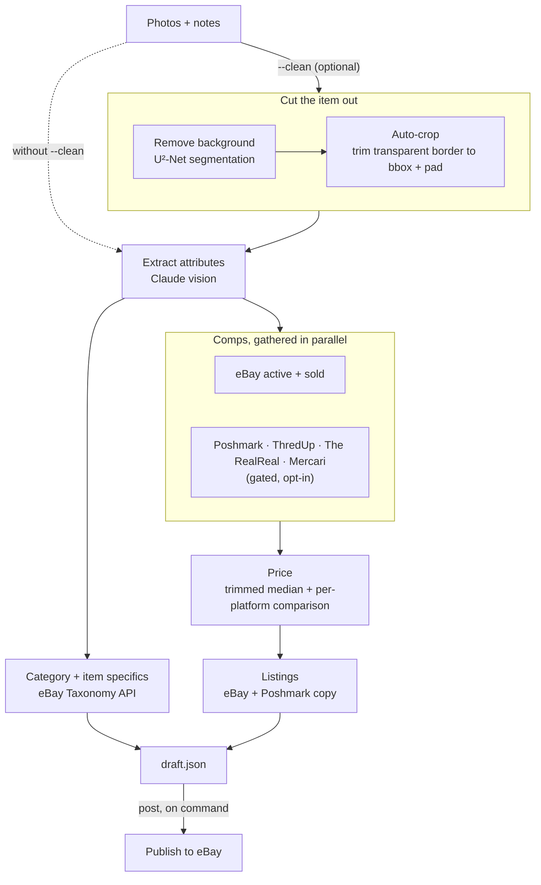

# resell-agent

A second-hand sales agent. Point it at photos of an item, it figures out what the
item is, prices it from comps, writes optimized listings for eBay and Poshmark,
and can publish the eBay listing for you.

Two halves:

- **Brain** (read-only, safe): photos → attributes → comps → price → listing copy.
  Comps are gathered in parallel across sources (eBay by default; Poshmark, ThredUp,
  The RealReal, Mercari optional), and the draft shows a per-platform price
  comparison. Only eBay is a sanctioned API — the rest are opt-in, ToS-risky
  scrapers, off unless you set their `ENABLE_*` flag. The suggested price stays
  eBay-anchored, since that's where `post` lists.
- **Hands** (eBay only for now): publishes a real listing via the eBay Sell API.

Poshmark has no public API. The tool writes you a ready-to-paste Poshmark listing
but does not auto-post there (automating that UI carries account-ban risk, so it's
left out). The optional Poshmark *price* source above only reads asking prices for
comparison, and carries the same risk — hence off by default.

## Why

Every year around graduation the same thing happens: leases end, dorms empty, and
a whole class has a couple of weeks to turn a room full of stuff — the winter coat,
the textbooks, the desk lamp, the barely-used coffee maker — into cash before the
move-out truck comes. The bottleneck was never willingness to sell. It's the tedium.
Every item needs a title, a price that isn't just a guess, the right category, and a
description rewritten for each platform. Do that thirty times in finals week and you
end up leaving half of it on the curb.

resell-agent is the shortcut for exactly that pile: photograph an item, and it does
the cataloging, the comps, and the copy, so listing takes seconds instead of ten
minutes. It started as a course project — but the deadline it's really built for is
graduation.

## How it works



### Cutting the item out (`--clean`)

Two steps, both in [`src/brain/bgremove.ts`](src/brain/bgremove.ts):

1. **Remove the background.** `@imgly/background-removal-node` runs a U²-Net
   segmentation model that classifies each pixel as subject or background, and
   erases the background — leaving a transparent PNG with just the item.
2. **Auto-crop to the item.** Because everything outside the item is now
   transparent, its bounding box *is* the non-transparent pixels. `sharp.trim()`
   removes the transparent border (cropping tight to the item), then a small
   transparent pad is added back so it isn't flush to the edge.

The result is a centered, tight, transparent cutout — cleaner input for the vision
step and listing-ready (eBay composites transparent PNGs onto white). The crop is
best-effort: if `sharp` is unavailable it falls back to the uncropped cutout.

A visual operating guide lives in [`docs/index.html`](docs/index.html) — serve it
(`python3 -m http.server -d docs`) or publish the `docs/` folder to GitHub Pages.
The walkthrough section has placeholder slots to drop your own photos and listing
screenshots into.

## Setup

1. Install and build: `npm install && npm run build` (rebuild after any code change)
2. `cp .env.example .env` and fill in:
   - `EBAY_CLIENT_ID`, `EBAY_CLIENT_SECRET` from developer.ebay.com to My Account to Application Keys
   - `ANTHROPIC_API_KEY`
   - keep `EBAY_ENV=sandbox` until you are ready to list for real

### For pricing only

Nothing else needed. The Browse API uses an app token that the tool fetches
automatically. You do need production Browse access approved on your eBay app if you
set `EBAY_ENV=production`.

### For posting (one-time)

Posting needs a user token plus a few account identifiers:

1. Register a redirect (RuName) on your eBay app and put it in `EBAY_REDIRECT_URI`.
2. `npm run auth-url`, open the printed URL, approve, copy the `code` from the redirect.
3. `npm run auth-exchange -- <code>`, paste the printed `EBAY_USER_REFRESH_TOKEN` into `.env`.
4. Create business policies (payment, return, fulfillment) and a merchant location once,
   via Seller Hub or the eBay Account API. Note the four IDs. You pass them to `post`.

## Usage

Draft (no posting):

```
npm run draft -- --photos front.jpg,back.jpg,tag.jpg --notes "small stain on left cuff"
```

Writes `draft.json` (data) and `draft.md` — a paste sheet with an eBay block and a
Poshmark block (title, price range, description, item specifics) plus the photo
references. The price is shown as a **range with a suggested starting point**, not a
single number, since it's comp-derived. Send the `.md` to whoever's listing the item;
they copy the block into their own account. Review before sharing.

Add `--clean` to remove photo backgrounds first (via `@imgly/background-removal-node`),
then auto-crop tight to the item (`sharp` trims the transparent margin, leaving a small
pad). It writes a transparent `*.clean.png` next to each photo — cleaner, centered input
for attribute extraction, and listing-ready (eBay composites transparent PNGs onto white).
Host those `.clean.png` files and pass them to `post --images`. Note: the remover and crop
pull native deps (`sharp`, `onnxruntime-node`) whose install scripts you must approve on
`npm install`, and the remover downloads its model on first run. Auto-crop is best-effort:
if `sharp` is unavailable it falls back to the uncropped cutout.

The draft step also resolves the eBay leaf category and fills item specifics
automatically (Taxonomy API), so `post` no longer needs `--category`.

Post the eBay listing:

```
npm run post -- --draft draft.json \
  --images https://your-host/img1.jpg,https://your-host/img2.jpg \
  --location my-location-key \
  --fulfillment <id> --payment <id> --return <id>
```

`--category <id>` is now optional — pass it only to override the auto-resolved one.

Image URLs must be publicly reachable (eBay pulls them). Host them somewhere first.

## Design notes

- Pricing uses sold comps when available. Sold data needs the Marketplace Insights API,
  which is separately gated. `getSoldComps` in `src/ebay/browse.ts` is fully wired but
  dormant: once eBay approves the `buy.marketplace.insights` scope for your app, set
  `EBAY_INSIGHTS=1` and it turns on with no code change. Until then the tool falls back
  to active-listing asks discounted 15 percent.
- Cross-platform price comparison: the draft shows a trimmed median + range per
  source (eBay sold, eBay active, Poshmark). Only eBay has a sanctioned API. The
  Poshmark, ThredUp, The RealReal, and Mercari sources (`src/poshmark.ts`,
  `thredup.ts`, `therealreal.ts`, `mercari.ts`, sharing `src/sources.ts`) hit
  unofficial internal endpoints — each is against that platform's ToS, fragile, and
  off unless you set its `ENABLE_*` flag; account/IP-ban risk is yours. Each yields
  `[]` when off or blocked, so the draft never depends on them. The suggested price
  stays eBay-anchored (post lists to eBay); other platforms only inform the
  comparison. Add another source behind the same `Comp[]` shape with a new `source`
  value and an `ENABLE_*` gate.
- Category and item specifics are resolved at draft time via the Taxonomy API
  (`src/ebay/taxonomy.ts` + `src/brain/aspects.ts`). Best-effort: if eBay can't suggest
  a category, the draft still builds and you pass `--category` on `post`.
- All the platform-specific eBay posting logic is in `src/ebay/sell.ts`. Swap in a
  Poshmark automation module later behind the same `ListingDraft` shape if you go there.
- The brain modules only depend on the Anthropic client, so you can reuse them headless.

## Layout

```
src/
  cli.ts            command line: draft | post | auth-url | auth-exchange
  pipeline.ts       photos -> priced listings
  types.ts
  config.ts         .env loader + eBay endpoint derivation
  brain/
    anthropic.ts    tiny Messages API client
    extract.ts      photos -> attributes (vision)
    price.ts        comps -> price (trimmed stats)
    listing.ts      attributes -> platform-tuned copy
    aspects.ts      attributes -> eBay item specifics
  ebay/
    auth.ts         app token (per-scope), user consent, refresh
    browse.ts       active comps + sold comps (dormant, EBAY_INSIGHTS)
    taxonomy.ts     category suggestion + required aspects
    sell.ts         inventory item -> offer -> publish
```

## Roadmap

- Marketplace Insights for real sold comps
- Batch mode: a folder of items in, many drafts out
- Poshmark read-only comps via a scraper, for cross-platform pricing
- Optional Poshmark Playwright poster (weigh the ToS risk first)
